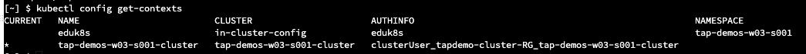
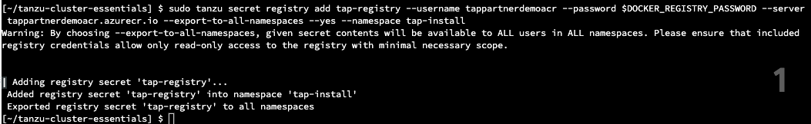
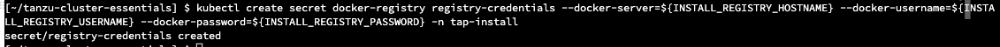

<p style="color:blue"><strong> Click here to test the execution in terminal</strong></p>

```execute-all
echo "Hello, Welcome to Partner workshop session"
```

<p style="color:blue"><strong> Set environment variable </strong></p>

```execute-all
export SESSION_NAME={{ session_namespace }}
```

<p style="color:blue"><strong> Click here to test the execution in terminal</strong></p>

```execute-1
ssh -i tap-workshop.pem $SESSION_NAME@10.0.1.62 -o StrictHostKeyChecking=accept-new
```

<p style="color:blue"><strong> Click here to check the Tanzu version</strong></p>

```execute-1
tanzu version
```

<p style="color:blue"><strong> Click here to check the AWS CLI version</strong></p>

```execute
aws --version
```

<p style="color:blue"><strong> Click here to check the kubectl version</strong></p>

```execute
kubectl version
```

Note: Since we are deploying TAP on TKGm cluster, cluster essentials is not being installed. If you are installing TAP on any other K8s cluster, the follow the steps in for installing Cluster essentials. 

<p style="color:blue"><strong> Set the context</strong></p>

```execute
kubectl config use-context $SESSION_NAME-admin@$SESSION_NAME
```

<p style="color:blue"><strong> Check if the current context is set to "{{ session_namespace }}"</strong></p>

```execute
kubectl config get-contexts
```

```execute-all
docker login harborairgap.tanzupartnerdemo.com
```

```execute-2
docker login registry.tanzu.vmware.com
```

```execute-all
export IMGPKG_REGISTRY_HOSTNAME=harborairgap.tanzupartnerdemo.com/$SESSION_NAME
```

```execute-all
export IMGPKG_REGISTRY_USERNAME=admin
```

```execute-all
export IMGPKG_REGISTRY_PASSWORD=Harbor12345
```

```execute-all
export TAP_VERSION=1.4.0
```

```execute-all
export REGISTRY_CA_PATH=PATH-TO-CA
```

```execute-2
imgpkg copy -b registry.tanzu.vmware.com/tanzu-application-platform/tap-packages:$TAP_VERSION --to-tar $HOME/tap-packages-$TAP_VERSION.tar --include-non-distributable-layers
```

```execute-2
scp -i tap-workshop.pem $HOME/tap-packages-$TAP_VERSION.tar $SESSION_NAME@$HOME
```

```execute-1
imgpkg copy --tar $HOME/tap-packages-$TAP_VERSION.tar --to-repo $IMGPKG_REGISTRY_HOSTNAME/tap-packages --include-non-distributable-layers --registry-ca-cert-path $REGISTRY_CA_PATH
```

<p style="color:blue"><strong> Create a namespace </strong></p>

```execute
kubectl create ns tap-install
```

```execute
tanzu secret registry add tap-registry --server   $IMGPKG_REGISTRY_HOSTNAME --username $IMGPKG_REGISTRY_USERNAME --password $IMGPKG_REGISTRY_PASSWORD --namespace tap-install --export-to-all-namespaces --yes
```

```execute
tanzu package repository add tanzu-tap-repository --url $IMGPKG_REGISTRY_HOSTNAME/tap-packages:$TAP_VERSION --namespace tap-install
```

```execute
tanzu package repository get tanzu-tap-repository --namespace tap-install
```

```execute
tanzu package available list --namespace tap-install
```

```execute
tanzu package available list tap.tanzu.vmware.com --namespace tap-install
```






```
tanzu secret registry add registry-credentials --server   $IMGPKG_REGISTRY_HOSTNAME --username $IMGPKG_REGISTRY_USERNAME --password $IMGPKG_REGISTRY_PASSWORD --namespace tap-install --export-to-all-namespaces --yes
```



<p style="color:blue"><strong> Verify the pods in kapp-controller namespace  and secretgen-controller </strong></p>

```execute
kubectl get pods -n kapp-controller
```

```execute
kubectl get pods -n secretgen-controller
```

<p style="color:blue"><strong> Changes to tap values file" </strong></p>

```execute
sed -i -r "s/password-registry/$DOCKER_REGISTRY_PASSWORD/g" $HOME/tap-values.yaml
```

```execute
sed -i -r "s/SESSION_NAME/$SESSION_NAME/g" $HOME/tap-values.yaml
```
