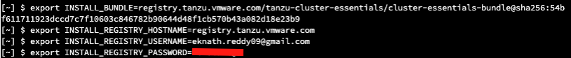
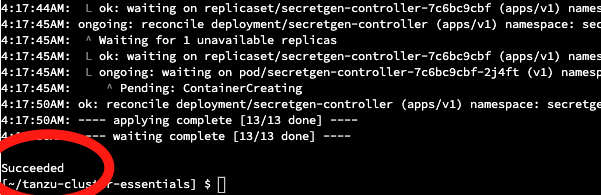

<p style="color:blue"><strong> Click here to test the execution in terminal</strong></p>

```execute-all
echo "Hello, Welcome to Partner workshop session"
```

<p style="color:blue"><strong> Set environment variable </strong></p>

```execute-all
export SESSION_NAME={{ session_namespace }}
```

<p style="color:blue"><strong> Click here to test the execution in terminal</strong></p>

```execute-1
ssh -i tap-workshop.pem $SESSION_NAME@10.0.1.62 -o StrictHostKeyChecking=accept-new
```

<p style="color:blue"><strong> Click here to check the Tanzu version</strong></p>

```execute-1
tanzu version
```

<p style="color:blue"><strong> Click here to check the AWS CLI version</strong></p>

```execute
aws --version
```

<p style="color:blue"><strong> Click here to check the kubectl version</strong></p>

```execute
kubectl version
```

###### Check below repo to view the workload content: 

```dashboard:open-url
url: https://gitea-tapdemo.tap.tanzupartnerdemo.com/tapdemo-user/tanzu-java-web-app
```


###### Provide ACR repo password and execute

```execute
export DOCKER_REGISTRY_PASSWORD=
```
  
<p style="color:blue"><strong> Docker login to image repo </strong></p>

```execute
docker login tapworkshopoperators.azurecr.io -u tapworkshopoperators -p $DOCKER_REGISTRY_PASSWORD
```

<p style="color:blue"><strong> Check if the current context is set to "{{ session_namespace }}-cluster" </strong></p>

```execute
kubectl config get-contexts
```


<p style="color:blue"><strong> Create a namespace </strong></p>

```execute
kubectl create ns tap-install
```

<p style="color:blue"><strong> Set environment variable </strong></p>



```execute
export INSTALL_BUNDLE=registry.tanzu.vmware.com/tanzu-cluster-essentials/cluster-essentials-bundle@sha256:54bf611711923dccd7c7f10603c846782b90644d48f1cb570b43a082d18e23b9
export INSTALL_REGISTRY_HOSTNAME=registry.tanzu.vmware.com
```

<p style="color:blue"><strong> Provide Tanzu network username and execute in terminal </strong></p>
  
*Note:* Just click on below command and paste in terminal 1, provide your <Tanzu Network Registry username> and press *ENTER* 

```copy-and-edit
export INSTALL_REGISTRY_USERNAME=<Tanzu Network Registry username>
```

<p style="color:blue"><strong> Provide the Tanzu network password and execute in terminal </strong></p>
  
*Note:* Just click on below command and paste in terminal 1, provide your <Tanzu Network password> and press *ENTER* 

```copy-and-edit
export INSTALL_REGISTRY_PASSWORD=<Tanzu Network password>
```

```execute
cd $HOME/tanzu-cluster-essentials
```

<p style="color:blue"><strong> Install cluster essentials in {{ session_namespace }}-cluster  </strong></p>

```execute
./install.sh -y
```



<p style="color:blue"><strong> Create tap-registry secret </strong></p>

```execute
sudo tanzu secret registry add tap-registry --username tapworkshopoperators --password $DOCKER_REGISTRY_PASSWORD --server tapworkshopoperators.azurecr.io --export-to-all-namespaces --yes --namespace tap-install
```


```execute
kubectl create secret docker-registry registry-credentials --docker-server=tapworkshopoperators.azurecr.io --docker-username=tapworkshopoperators --docker-password=$DOCKER_REGISTRY_PASSWORD -n tap-install
```


<p style="color:blue"><strong> Verify the pods in kapp-controller namespace  and secretgen-controller </strong></p>

```execute
kubectl get pods -n kapp-controller
```

```execute
kubectl get pods -n secretgen-controller
```

<p style="color:blue"><strong> Changes to tap values file" </strong></p>

```execute
sed -i -r "s/password-registry/$DOCKER_REGISTRY_PASSWORD/g" $HOME/tap-values.yaml
```

```execute
sed -i -r "s/password-registry/$DOCKER_REGISTRY_PASSWORD/g" $HOME/autoheal.sh
```

```execute
sed -i -r "s/SESSION_NAME/$SESSION_NAME/g" $HOME/tap-values.yaml
```
