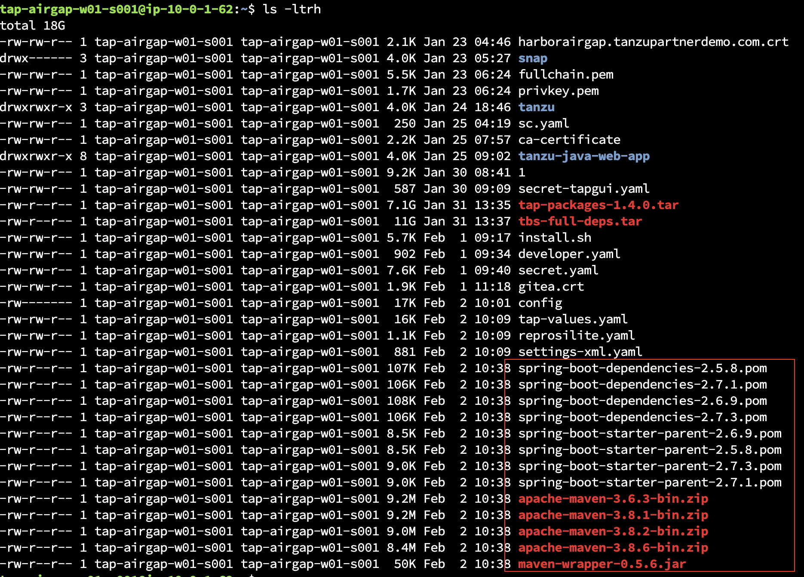

<p style="color:blue"><strong> Review reprosilite yaml file </strong></p>

```execute
cat $HOME/reprosilite.yaml
```

<p style="color:blue"><strong> Create namespace reposilite </strong></p>

```execute
kubectl create ns reposilite
```

<p style="color:blue"><strong> Create secret using the pem files already saved in JB </strong></p>

```execute
kubectl create secret tls  my-tls-secret --cert=$HOME/fullchain.pem  --key=$HOME/privkey.pem -n reposilite
```

<p style="color:blue"><strong> Apply reprosilite yaml file in namespace reposilite </strong></p>

```execute
kubectl apply -f $HOME/reprosilite.yaml -n reposilite
```

<p style="color:blue"><strong> Check the pods in namespace reposilite, proceed further once the pods are in running state</strong></p>

```execute
kubectl get all -n reposilite
```


<p style="color:blue"><strong> Check the load balancer </strong></p>

```execute
loadbalancer=$(kubectl get svc envoy -n tanzu-system-ingress -o jsonpath='{.status.loadBalancer.ingress[0].hostname}')
echo $loadbalancer
```

#### Note: Provide the loadbalancer hostname and {{ session_namespace }} to SE in chat. 

```execute-2
cd $HOME/tanzu-java-web-app
```

```execute-2
JAVA_HOME='/opt/jdk-13.0.1' && PATH="$JAVA_HOME/bin:$PATH" && export PATH && M2_HOME='/opt/apache-maven-3.6.3' && PATH="$M2_HOME/bin:$PATH" && export PATH
```

<p style="color:blue"><strong> Verify the maven version </strong></p>

```execute-2
mvn --version
```

<p style="color:blue"><strong> Build maven locally </strong></p>

```execute-2
mvn package
```


##### As instructed during the briefing, please check the email from App Stream which contains a link to access App Stream, First login with temporary credentials, then reset the password and access Chrome app in App Stream. This will open a new browser session in App Stream which should 1-3 mins to load completely. Once launched successfully, Access the TAP URL and workloads from same browser. 

###### Once the DNS record is created for Reposilite, access the reposilite url from App Stream browser: https://reposilite.{{ session_namespace }} .tap.tanzupartnerdemo.com using Chrome Browser (incongnito preferred)


<p style="color:blue"><strong> Now, lets copy the files into Reposilite pod using below commands:   </strong></p>

```execute-2
scp -i ~/tap-workshop.pem -r /root/.m2/ $SESSION_NAME@10.0.1.62:/home/$SESSION_NAME
```

```execute-2
scp -i ~/tap-workshop.pem $HOME/files/*.pom $SESSION_NAME@10.0.1.62:/home/$SESSION_NAME
```

```execute-2
scp -i ~/tap-workshop.pem $HOME/files/*.zip $SESSION_NAME@10.0.1.62:/home/$SESSION_NAME
```

```execute-2
scp -i ~/tap-workshop.pem $HOME/files/*.jar $SESSION_NAME@10.0.1.62:/home/$SESSION_NAME
```

```execute-1
ls -ltrh $HOME
```



<p style="color:blue"><strong> Collect the Reposilite pod name </strong></p>
 
```execute
reposilitepod=$(kubectl get pods -n reposilite -o=jsonpath="{.items[*]['metadata.name', 'status.phase=Running']}")
```

```execute
echo $reposilitepod
```

<p style="color:blue"><strong> Copy the maven repo into Reposilite pod </strong></p>

```execute
kubectl cp .m2/repository/ $reposilitepod:/app/data/repositories/releases -n reposilite
```

<p style="color:blue"><strong> Copy the pom, jar and zip files into Reposilite pod </strong></p>

```execute
kubectl cp spring-boot-starter-parent-2.5.8.pom $reposilitepod:/app/data/repositories/releases -n reposilite
```

```execute
kubectl cp spring-boot-dependencies-2.5.8.pom $reposilitepod:/app/data/repositories/releases -n reposilite
```

```execute
kubectl cp apache-maven-3.6.3-bin.zip $reposilitepod:/app/data/repositories/releases -n reposilite
```

```execute
kubectl cp maven-wrapper-0.5.6.jar $reposilitepod:/app/data/repositories/releases -n reposilite
```

```execute
kubectl exec -it $reposilitepod -n reposilite -- bash
```

```execute
bind 'set enable-bracketed-paste off'
```

```execute
cd data/repositories/releases
```

```execute
mv repository/* .
```

```execute
rm repository -r
```

```execute
mkdir -p org/springframework/boot/spring-boot-dependencies/2.5.8/
```

```execute
mv spring-boot-dependencies-2.5.8.pom org/springframework/boot/spring-boot-dependencies/2.5.8/
```

```execute
mkdir -p org/springframework/boot/spring-boot-starter-parent/2.5.8/
```

```execute
mv spring-boot-starter-parent-2.5.8.pom org/springframework/boot/spring-boot-starter-parent/2.5.8/
```

```execute
mkdir -p org/apache/maven/wrapper/0.5.6/
```

```execute
mv maven-wrapper-0.5.6.jar  org/apache/maven/wrapper/0.5.6/
```

```execute
mkdir -p org/apache/maven/apache-maven/3.6.3/
```

```execute
mv apache-maven-3.6.3-bin.zip  org/apache/maven/apache-maven/3.6.3/
```

##### Access the reposilite url from App Stream browser: https://reposilite{{ session_namespace }}.tap.tanzupartnerdemo.com/#/releases and verify the copied files under releases as shown below: 


```execute
exit
```
