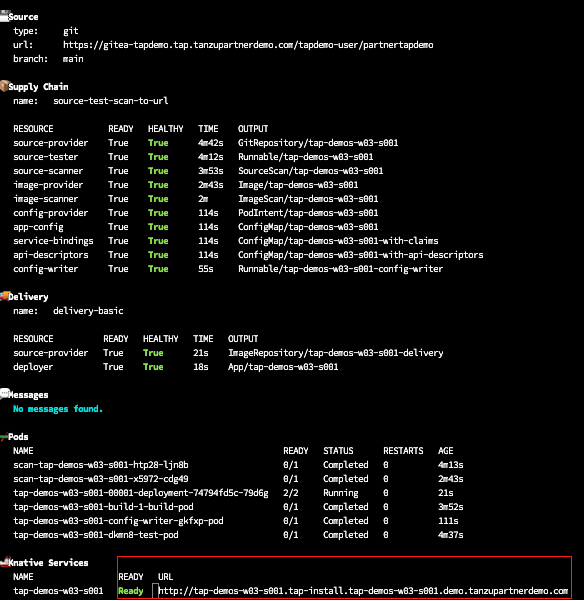
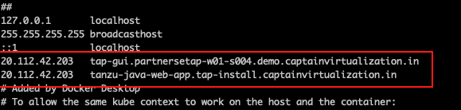
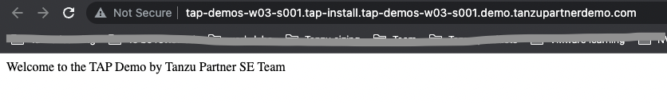
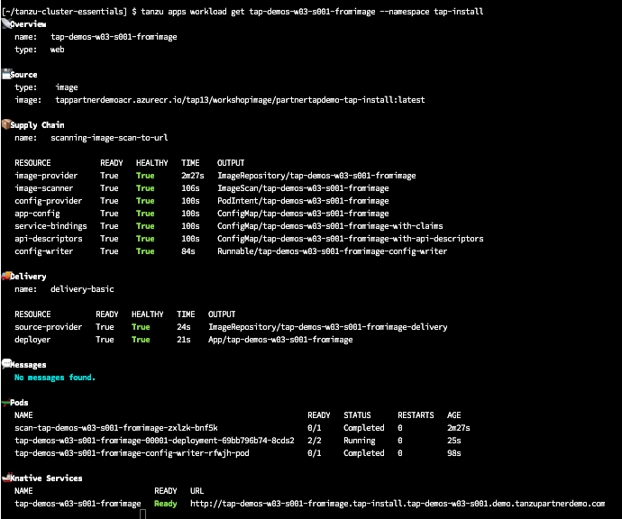
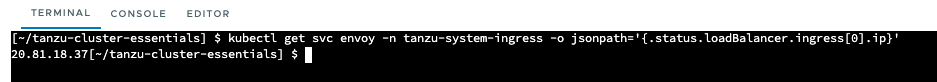
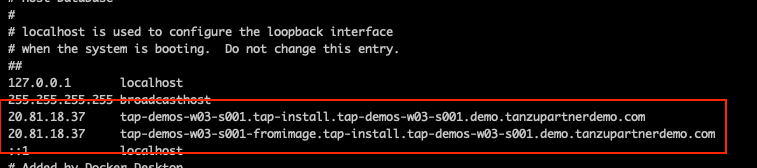

<p style="color:blue"><strong> Review below yaml files </strong></p>

```execute
cat $HOME/developer.yaml
```

```execute
cat $HOME/settings-xml.yaml
```

<p style="color:blue"><strong> Setup developer namespace </strong></p>

```execute
kubectl apply -f $HOME/developer.yaml -n tap-workload
```

```execute
kubectl apply -f $HOME/settings-xml.yaml -n tap-workload
```

```execute
kubectl apply -f $HOME/ca-certificate -n tap-workload
```

<p style="color:blue"><strong> List the packages installed </strong></p>

```execute
tanzu package installed list -A
```

* Open the file to edit the value of mvn wrapper properties 
```editor:select-matching-text
file: /home/eduk8s/tanzu-java-web-app/.mvn/wrapper/maven-wrapper.properties
text: "reposiliteairgap"
```

* Update the value of `distributionUrl` and `wrapperUrl`
```editor:replace-text-selection
file: /home/eduk8s/tanzu-java-web-app/.mvn/wrapper/maven-wrapper.properties
text: {{ session_namespace }}
```

* Open the file to edit the value of mvnw and point to reposilite maven repository
```editor:select-matching-text
file: /home/eduk8s/tanzu-java-web-app/mvnw
text: "reposiliteairgap"
```

* Update the value of `jarUrl`
```editor:replace-text-selection
file: /home/eduk8s/tanzu-java-web-app/mvnw
text: {{ session_namespace }}
```

* Open the file to edit the value of `DOWNLOAD_URL` env variable
```editor:select-matching-text
file: /home/eduk8s/tanzu-java-web-app/mvnw.cmd
text: "reposiliteairgap"
```

* Update the value of `DOWNLOAD_URL`
```editor:replace-text-selection
file: /home/eduk8s/tanzu-java-web-app/mvnw.cmd
text: {{ session_namespace }}
```

```execute
tanzu apps workload create {{ session_namespace }}-app --local-path tanzu-java-web-app/ --type web -n tap-workload --source-image harborairgap.tanzupartnerdemo.com/{{ session_namespace }}/build-service/tanzu-java-web-app-source-new --param-yaml buildServiceBindings='[{"name": "settings-xml", "kind": "Secret"}, {"name": "ca-certificate", "kind": "Secret"}]' --build-env "BP_MAVEN_BUILD_ARGUMENTS=-debug -Dmaven.test.skip=true --no-transfer-progress package" -y
```

<p style="color:blue"><strong> Get the status of deployed application </strong></p>

```execute
tanzu apps workload get {{ session_namespace }}-app -n tap-workload
```

<p style="color:blue"><strong> Check the live progress of application </strong></p>

```execute-1
tanzu apps workload tail {{ session_namespace }}-app --since 10m --timestamp -n tap-workload
```

```execute-1
<ctrl+c>
```

<p style="color:blue"><strong> Check all the installed applications </strong></p>

```execute
tanzu apps workload list -n tap-workload
```

<p style="color:blue"><strong> Get the pods in tap-install namespace </strong></p>

```execute
kubectl get pods -n tap-workload
```

###### Note: Workload creation takes 5 mins to complete, proceed further once you see ready status

```execute
tanzu apps workload get {{ session_namespace }}-app -n tap-workload
```



###### Apply Annotation

```execute
tanzu apps workload apply {{ session_namespace }}-app --annotation autoscaling.knative.dev/minScale=1 -n tap-workload -y
```

<p style="color:blue"><strong> Collect the load balancer IP </strong></p>

```execute
lbip=$(nslookup $envoyloadbalancer | awk -F': ' 'NR==6 { print $2 } ')
```

###### IN windows JB, add an entry in host file pointing the $lbip with {{ session_namespace }}-app.tap-workload.tanzupartnerdemo.com



<p style="color:blue"><strong> Access the deployed application in windows JB - https://{{ session_namespace }}-app.tap-workload.tanzupartnerdemo.com</strong></p>




### Pre-build image: 

```dashboard:open-url
url: https://docs.vmware.com/en/VMware-Tanzu-Application-Platform/1.3/tap/GUID-scc-pre-built-image.html
```

```execute
tanzu apps workload list -n tap-workload
```

Note: Image is already created for this workshop and uploaded to Harbor Registry. 

```execute
tanzu apps workload create {{ session_namespace }}-fromimage --image harborairgap.tanzupartnerdemo.com/tapairgap/prebuildimage:latest --type web --app {{ session_namespace }}-fromimage -n tap-workload -y
```

```execute-1
tanzu apps workload tail {{ session_namespace }}-fromimage --namespace tap-workload
```

```execute-1
<ctrl+c>
```

```execute
tanzu apps workload get {{ session_namespace }}-fromimage -n tap-workload
```






###### IN windows JB, add an entry in host file pointing the $lbip with {{ session_namespace }}-fromimage.tap-workload.tanzupartnerdemo.com



<p style="color:blue"><strong> Access the deployed application </strong></p>

###### Access the deployed application in windows JB - https://{{ session_namespace }}-fromimage.tap-workload.tanzupartnerdemo.com
