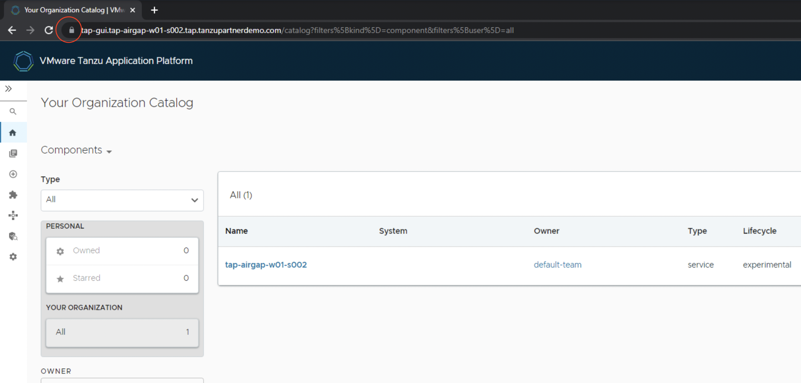

Tanzu Application Platform GUI is a tool for your developers to view your applications and services running for your organization. This portal provides a central location in which you can view dependencies, relationships, technical documentation, and the service status.
Tanzu Application Platform GUI consists of the following components:

Tanzu Application Platform GUI plug-ins:

   - Runtime Resources Visibility
  
   - Application Live View
  
   - Application Accelerator
  
   - API Documentation
  
   - Supply Chain Choreographer

   - TechDocs

###### In this section, lets see how to access TAP-GUI once installed with full profile. 

<p style="color:blue"><strong> Verify the pods in tap-gui namespace </strong></p>

```execute
kubectl get pods -n tap-gui
```

#### TLS for TAP GUI: 

```execute
kubectl create secret tls tap-gui-secret --key="privkey.pem" --cert="fullchain.pem" -n tap-gui
```

###### Remove # from lines ( 206-208 ) of tap-values.yaml, located in home directory 

```execute
vi $HOME/tap-values.yaml
```


```execute
tanzu package installed update tap -f tap-values.yaml -n tap-install
```

<p style="color:blue"><strong> Access TAP-GUI url in App Stream browser: https://tap-gui.{{ session_namespace }}.tap.tanzupartnerdemo.com {{copy}} </strong></p>


