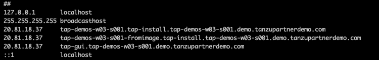

Tanzu Application Platform GUI is a tool for your developers to view your applications and services running for your organization. This portal provides a central location in which you can view dependencies, relationships, technical documentation, and the service status.
Tanzu Application Platform GUI consists of the following components:

Tanzu Application Platform GUI plug-ins:

   - Runtime Resources Visibility
  
   - Application Live View
  
   - Application Accelerator
  
   - API Documentation
  
   - Supply Chain Choreographer

   - TechDocs

###### In this section, lets see how to access TAP-GUI once installed with full profile. 

<p style="color:blue"><strong> Verify the pods in tap-gui namespace </strong></p>

```execute
kubectl get pods -n tap-gui
```

<p style="color:blue"><strong> Collect the load balancer IP </strong></p>

```execute
export envoyloadbalancer=$(kubectl get svc envoy -n tanzu-system-ingress -o jsonpath='{.status.loadBalancer.ingress[0].hostname}')
```

```execute
nslookup $envoyloadbalancer | awk -F': ' 'NR==6 { print $2 } '
```

###### Add an entry in local host /etc/hosts path pointing the above collected IP with {{ session_namespace }}-fromimage.tap-workload.tanzupartnerdemo.com

Example for ref: 



<p style="color:blue"><strong> Access TAP GUI </strong></p>

```dashboard:open-url
url: http://tap-gui.{{ session_namespace }}.tap.tanzupartnerdemo.com
```

Example for ref: 


TLS for TAP GUI: 

```execute
kubectl create secret tls tap-gui-secret --key="privkey.pem" --cert="fullchain.pem" -n tap-gui
```

Remove # from lines from 103-105

```execute
tanzu package installed update tap -f tap-values.yaml -n tap-install
```
