The Application Live View features of the Tanzu Application Platform include sophisticated components to give developers and operators a view into their running workloads on Kubernetes.

Application Live View shows an individual running process: Before proceeding further, ensure to check if the appliveview is resolving the IP address

```execute-1
nslookup appliveview.{{ session_namespace }}.tap.tanzupartnerdemo.com	
```

<p style="color:blue"><strong> Connect to TAP GUI from in App Stream browser by accessing the url: https://tap-gui.{{ session_namespace }}.tap.tanzupartnerdemo.com/catalog/default/component/{{ session_namespace }}/workloads </strong></p>

###### In Tap GUI, Click on deployment resource as shown below: 

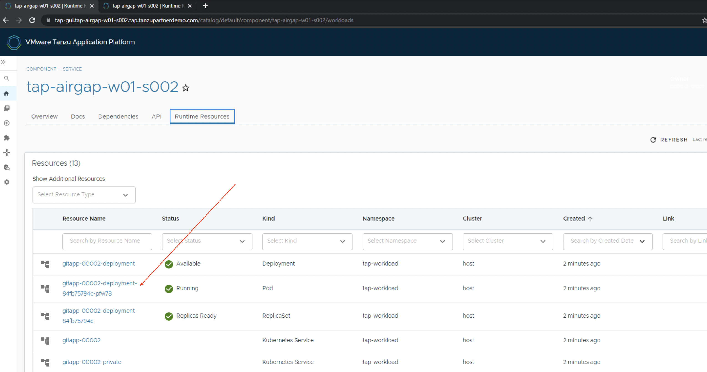

###### Scroll down for app live view section: 

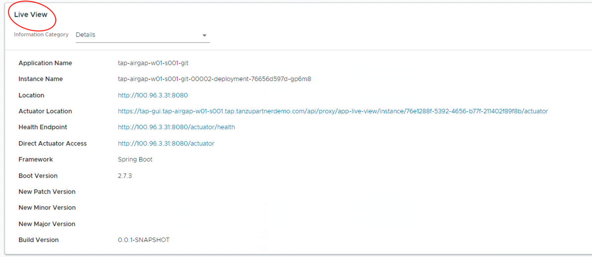

##### Health page

To navigate to the Health page, select the Health option from the Information Category drop-down. The health page provides detailed information about the health of the app.

The page includes the following features:

  - View a list of all the components that make up the health of the app, such as readiness, liveness, and disk space.
  - View a display of the status and details associated with each of the components.


##### Environment page

To navigate to the Environment page, select the Environment option from the Information Category drop-down. The environment page contains details of the app's environment. It contains properties including, but not limited to, system properties, environment variables, and configuration properties such as application.properties in a Spring Boot app.

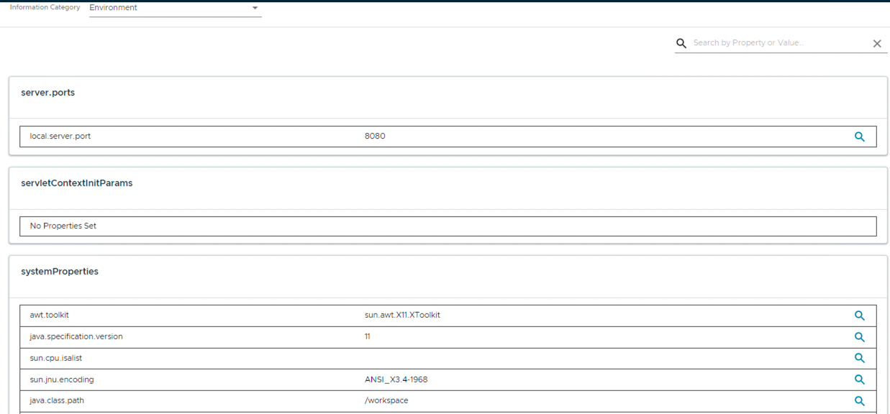
    
##### Log Levels page

To navigate to the Log Levels page, select the Log Levels option from the Information Category drop-down. The log levels page provides access to the app's loggers and the configuration of their levels.

The page includes the following features:

   - Configure the log levels, such as INFO, DEBUG, TRACE, in real-time from the UI.
   - Search for a package and edit its respective log level.
   - Configure the log levels at a specific class and package.
   - Deactivate all the log levels by modifying the log level of root logger to OFF.
   - Display the changed log levels using the Changes Only toggle.
   - Search by logger name using the search feature.
   - Reset the log levels to the original state clicking Reset.
   - Reset all the loggers to default state by clicking Reset All at the top right corner of the page.

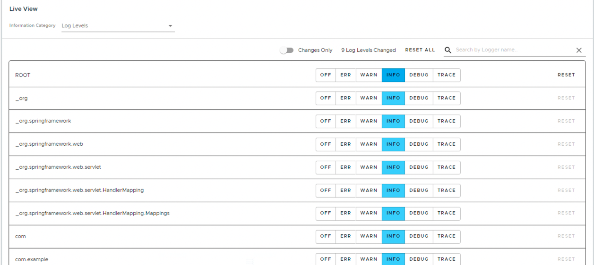

##### Threads page

To navigate to the Threads page, select the Threads option from the Information Category drop-down. This page displays all details related to JVM threads and running processes of the app. This tracks live threads and daemon threads real-time. It is a snapshot of different thread states.

The page includes the following features:

   - Navigate to a thread state to display all the information about a particular thread and its stack trace.
   - Search for threads by thread ID or state using the search feature.
   - Refresh to the latest state of the threads using the refresh icon.
   - View more thread details by clicking on the thread ID.
   - Download a thread dump for analysis purposes.

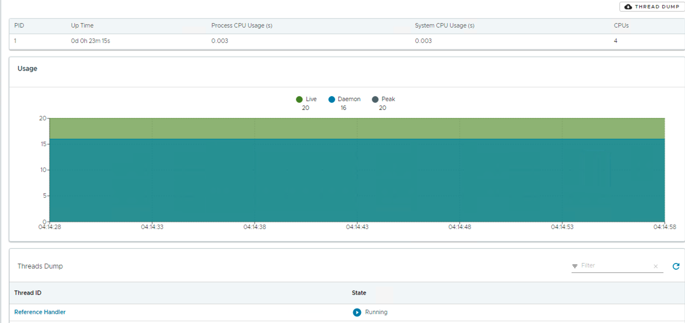

##### Memory page

To navigate to the Memory page, select the Memory option from the Information Category drop-down.

The memory page highlights the memory use inside of the JVM. It displays a graphical representation of the different memory regions within heap and non-heap memory. For Spring Boot apps running on a JVM, this visualizes data from inside of the JVM, and therefore provides memory insights into the app in contrast to "outside" information about the Kubernetes pod level.

The page includes the following features:

   - View real-time graphs that display a stacked overview of the different spaces in memory along with the total memory used and total memory size.
   - View graphs to display the GC pauses and GC events.
   - Download heap dump data using the Heap Dump button at the top right corner.

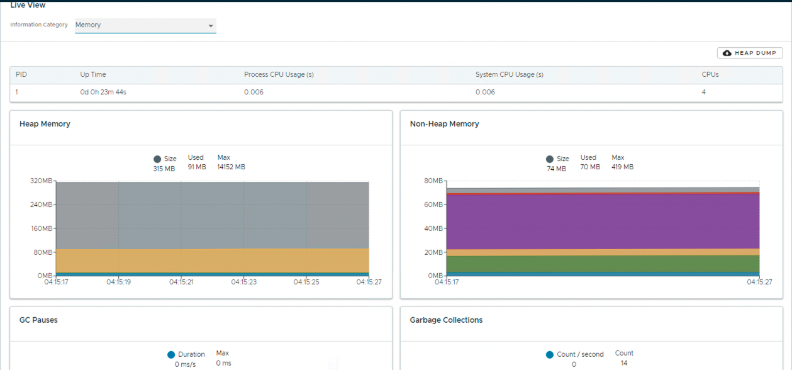

##### Request Mappings page

To navigate to the Request Mappings page, select the Request Mappings option from the Information Category drop-down. This page provides information about the app's request mappings. For each mapping, the page displays the request handler method.

The page includes the following features:

   - View more details about the request mapping, such as the header metadata of the app including the produces, consumes, and HTTP methods, by clicking on the mapping.
   - Search on the request mapping or the method.
   - View the actuator related mappings for the app using the toggle /actuator/** Request Mappings

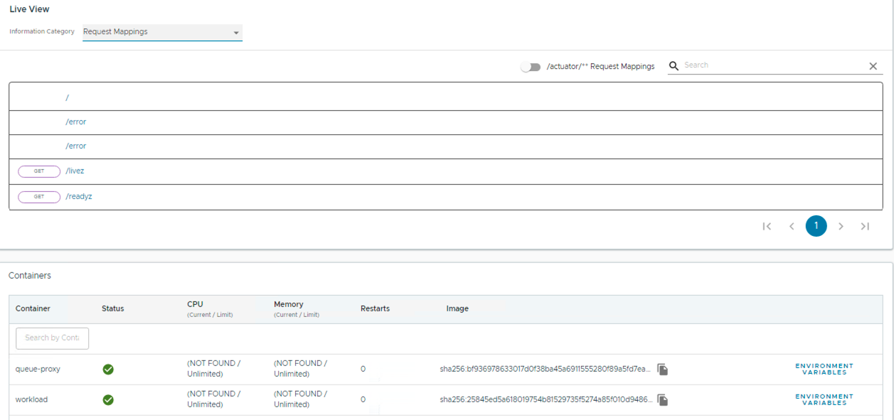

##### HTTP Exchanges

To navigate to the HTTP Exchanges page, select the HTTP Exchanges option from the Information Category drop-down. The HTTP Exchanges page provides information about HTTP request-response exchanges to the app. The graph visualizes the requests per second indicating the response status of all the requests.

The page includes the following features:

   - Filter on the response statuses which include info, success, redirects, client-errors, and server-errors.
   - View the trace data, captured in detail in a tabular format with metrics such as timestamp, method, path, status, content-type, length, and time.
   - Filter the traces based on the search field value using the search feature on the table
   - View more details of the request such as method, headers, and response of the app by clicking on the timestamp.
   - Click the refresh icon above the graph to load the latest traces for the app.
   - Display the actuator related traces for the app using the toggle /actuator/** at the top right corner of the page.


##### Configuration Properties page

To navigate to the Configuration Properties page, select the Configuration Properties option from the Information Category drop-down. The configuration properties page provides information about the configuration properties of the app. For Spring Boot, it displays the app's @ConfigurationProperties beans. It gives a snapshot of all the beans and their associated configuration properties.

The page includes the following feature:

  - Look up a key-value for a property or bean name using the search feature.

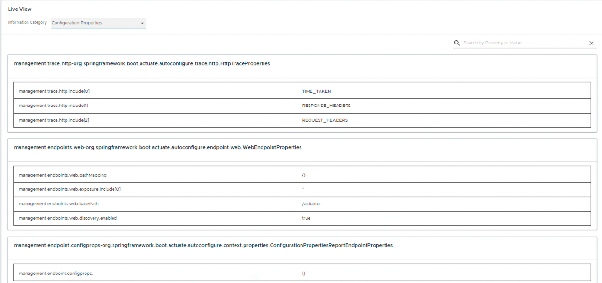

##### Caches 

To navigate to the Caches page, the user can select the Caches option from the Information Category drop-down menu.

The Caches page provides access to the application’s caches. It gives the details of the cache managers associated with the application including the fully qualified name of the native cache.

The search feature in the Caches Page enables the user to search for a specific cache/cache manager. The user can clear individual caches by clicking Evict. The user can clear all the caches completely by clicking Evict All. If there are no cache managers for the application, the message No cache managers available for the application is displayed.


##### ScheduledTasks

To navigate to the Scheduled Tasks page, the user can select the Scheduled Tasks option from the Information Category drop-down menu.

The scheduled tasks page provides information about the application’s scheduled tasks. It includes cron tasks, fixed delay tasks and fixed rate tasks, custom tasks and the properties associated with them.

The user can search for a particular property or a task in the search bar to retrieve the task or property details. For this workload there are no scheduled task created.


##### Conditions page

To navigate to the Conditions page, select the Conditions option from tthe Information Category drop-down. The conditions evaluation report provides information about the evaluation of conditions on configuration and auto-configuration classes. For Spring Boot, this gives the user a clear view of all the beans configured in the app.

The page includes the following features:

   - Click on the bean name to view the conditions and the reason for the conditional match. If beans are not configured, it shows both the matched and unmatched conditions of the bean if any. In addition to this, it also displays names of unconditional auto configuration classes if any.
   - Filter on the beans and the conditions using the search feature.


##### Beans page

To navigate to the Beans page, select the Beans option from the Information Category drop-down. The beans page provides information about a list of all app beans and its dependencies. It displays the information about the bean type, dependencies, and its resource.

The page includes the following feature:

   - Search by the bean name or its corresponding fields.

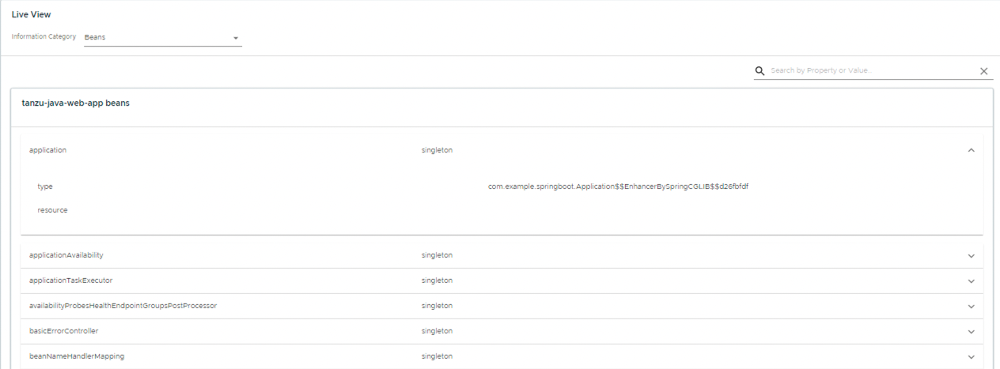

##### Metrics Page

To navigate to the Metrics page, select the Metrics option from the Information Category drop-down. The metrics page provides access to app metrics information.

The page includes the following features:

   - Choose from the list of various metrics available for the app such as jvm.memory.used, jvm.memory.max, http.server.request. After you choose the metric, you can view the associated tags.
   - Choose the value of each of the tags based on filtering criteria.
   - Click Add Metric to add the metric, which is refreshed every five seconds by default.
   - Pause the auto refresh feature by disabling the Auto Refresh toggle.
   - Refresh the metrics manually by clicking Refresh All.
   - Change the format of the metric value according to your needs.
   - Delete a particular metric by clicking on the minus symbol in the same row.

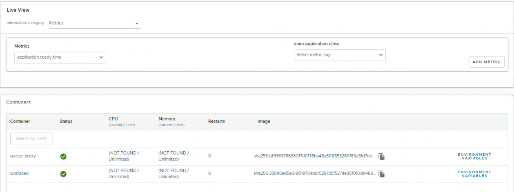

##### Actuator Page
To navigate to the Actuator page, select the Actuator option from the Information Category drop-down. The actuator page provides a tree view of the actuator data.

The page includes the following feature:

   - Choose from a list of actuator endpoints and parse through the raw actuator data.

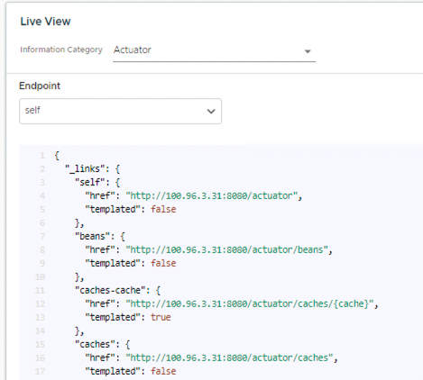
