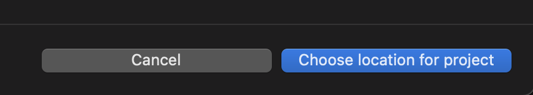

Tanzu Application Platform provides an easy way to browse and consume templates that have been approved for use by the organization. It's called **Application Accelerator**, and its hosted in the web interface for Tanzu Application Platform, also known as TAP GUI. 
* Enterprise Architects use Application Accelerator to provide developers and operators in their organization with enterprise-compliant templates for code and configurations.
* Developers use Application Accelerator to create or access projects which follow enterprise standards.

We're going to check out **Application Accelerator** by accessing the below url in App Stream browser. 


###### https://tap-gui.{{ session_namespace }}.tap.tanzupartnerdemo.com/create


Now, you can discover a template that is appropriate for the programming language (e.g. Java, .NET, Node) and the application type (i.e. Web, message-driven, function). You can use the template to start a new project, or use the template to migrate a pre-existing application.


Below command shows the list of Default Accelerators: 

```execute
tanzu accelerator list 
```

```execute
kubectl get pods -n accelerator-system
```

Access the url in App Stream browser to check the accelerator file that will be used in next steps: 

##### https://gitlab.tap.tanzupartnerdemo.com/gitlab-instance-081097ef/partnertapdemo-app/-/blob/main/accelerator.yaml

##### Check the Accelerator section for details: 

```execute
cat $HOME/tap-values.yaml
```

###### Create custom Accelerator

```execute
tanzu accelerator create {{ session_namespace }} --git-repository https://gitlab.tap.tanzupartnerdemo.com/gitlab-instance-081097ef/partnertapdemo-app --git-branch main --display-name "$SESSION_NAME" --secret-ref git-credentials
```

```execute
tanzu accelerator list 
```

###### In App Stream browser, Access the url https://tap-gui.{{ session_namespace }}.tap.tanzupartnerdemo.com/create/templates/{{ session_namespace }} to generate accelerators. 

Note: Below steps are for reading only. 

Let's work with the Spring project template. Press the choose button in the tile for `{{ session_namespace }}` accelerator. The UI will offer some optional parameters for customizing the project template, you can accept the defaults and hit **Next**. You'll then be prompted to review your choices, and you can press **Generate Accelerator**.

Application Accelerator now creates your project template, and gives you the option of browsing or downloading the template. Let's browse it by clicking "Explore Zip File"


If you drill down into the files in the Explore Project view, you will see that they mostly consist of source code files that you would use for a starter application, plus some generated files that will give Tanzu Application Platform additional context for working with the application. 

As we are constantly trying to improve developer experience, From TAP 1.3, there is another way to consume accelerators and it is using your favourite editor e.g. VSCode. We provide a VSCode plugin that you can install & configure in seconds and start using accelerators. Once configured, you will get a separate tab for Tanzu as follows:-


You can click on any accelerator and generate the project that will be opened in vscode automatically for you to start coding.
e.g. Click on **Hello World** accelerator.


Click on **Generate** button to save the project and select the location.



Once saved, VSCode will automatically open the project for you.
