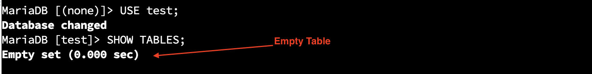
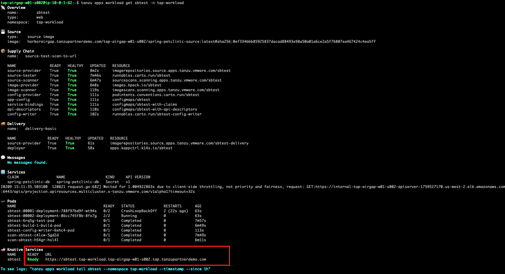
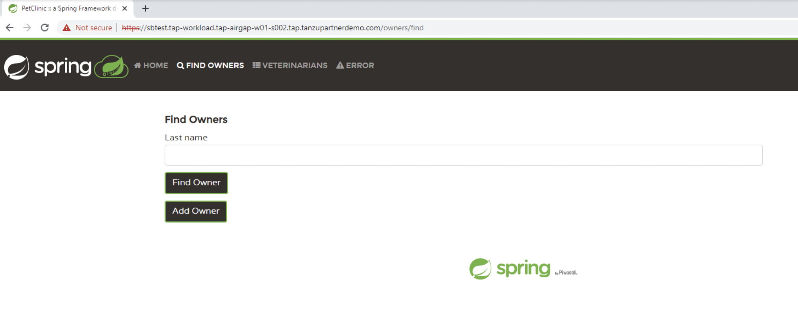
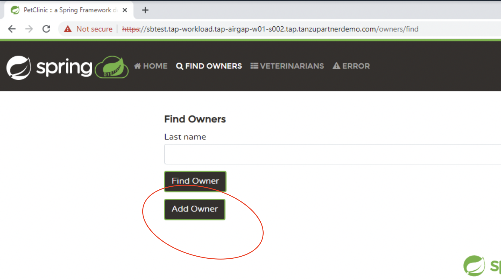
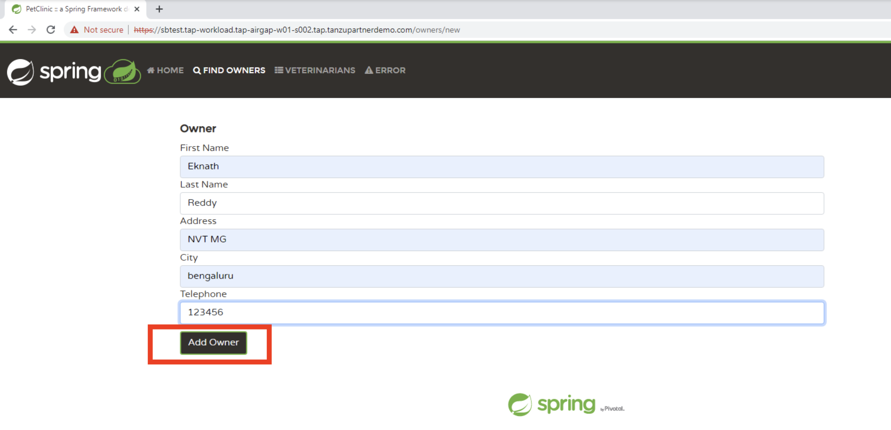
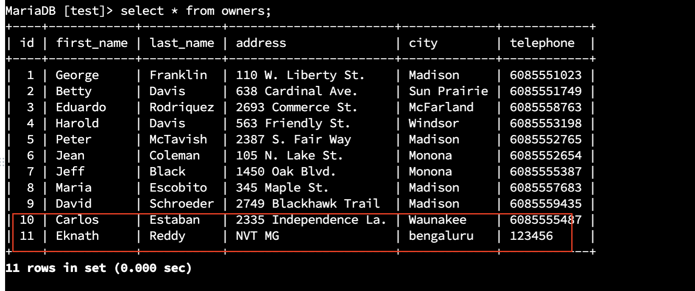

For this workshop, I have already downloaded the required Maria DB image from VMware Application Catalog and uploaded into Harbor Registry. 

<p style="color:blue"><strong>  </strong></p>

```execute
cat $HOME/mariadb-install.yaml
```

<p style="color:blue"><strong> Review below yaml files </strong></p>

```execute
cat $HOME/workload-springpetclinic.yaml
```

<p style="color:blue"><strong> Review below yaml files </strong></p>

```execute
kubectl apply -f $HOME/mariadb-install.yaml -n tap-workload
```
<p style="color:blue"><strong> Review below yaml files </strong></p>

```execute
kubectl get pods -n tap-workload
```
<p style="color:blue"><strong> Review below yaml files </strong></p>

```execute
dbpod=$(kubectl get pods -n tap-workload --no-headers=true | awk '/db/{print $1}' | xargs)
```
<p style="color:blue"><strong> Review below yaml files </strong></p>

```execute
echo $dbpod
```
<p style="color:blue"><strong> Review below yaml files </strong></p>

```execute
kubectl exec -it $dbpod -n tap-workload -- bash
```
<p style="color:blue"><strong> Connect to DB, by providing the password as "secret" </strong></p>

```execute
mysql -h spring-petclinic-db -uroot -p
```
<p style="color:blue"><strong> Review below yaml files </strong></p>

```execute
SHOW DATABASES;
```

<p style="color:blue"><strong> Review below yaml files </strong></p>

```execute
USE test;
```

```execute
SHOW TABLES;
```



```execute
GRANT ALL PRIVILEGES ON *.* TO 'user'@'%' IDENTIFIED BY "pass";
```

```execute
\q
```

```execute
exit
```

```execute
tanzu apps workload apply -f $HOME/workload-springpetclinic.yaml --local-path $HOME/spring-petclinic-2.6.0-SNAPSHOT.jar --source-image harborairgap.tanzupartnerdemo.com/{{ session_namespace }}/spring-petclinic-source -n tap-workload --type web --label apps.tanzu.vmware.com/has-tests=true -y
```

```execute
tanzu apps workload get sbtest -n tap-workload
```

```execute
tanzu apps workload tail sbtest --since 10m --timestamp -n tap-workload
```

```execute
<ctrl+c>
```

```execute
tanzu apps workload get sbtest -n tap-workload
```



Access the workload https://sbtest.tap-workload.{{ session_namespace }}.tap.tanzupartnerdemo.com {{copy}} from App Stream browser url



```execute
kubectl exec -it $dbpod -n tap-workload -- bash
```

<p style="color:blue"><strong> Connect to DB, by providing the password as "secret" </strong></p>

```execute
mysql -h spring-petclinic-db -uroot -p
```
<p style="color:blue"><strong> Review below yaml files </strong></p>

```execute
SHOW DATABASES;
```

<p style="color:blue"><strong> Review below yaml files </strong></p>

```execute
USE test;
```

<p style="color:blue"><strong> Review below yaml files </strong></p>

```execute
SHOW TABLES;
```

<p style="color:blue"><strong> Review below yaml files </strong></p>

```execute
select * from owners;
```

Now get back to App stream and add owner details: 

Find Owners > Add Owner > 






```execute
select * from owners;
```


