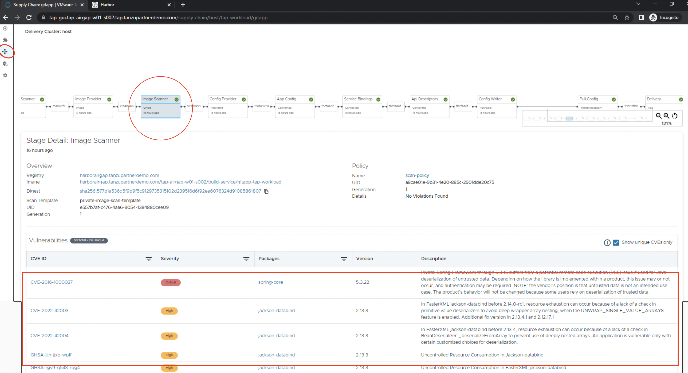

Supply Chain Security Tools - Store saves software bills of materials (SBoMs) to a database and allows you to query for image, source code, package, and vulnerability relationships. It integrates with Supply Chain Security Tools - Scan to automatically store the resulting source code and image vulnerability reports. It accepts CycloneDX input and outputs in both human-readable and machine-readable formats, including JSON, text, and CycloneDX.


Navigate to App Stream Browser > Access TapGUI > Supply Chains > https://tap-gui.{{ session_namespace }}.tap.tanzupartnerdemo.com/supply-chain/host/tap-workload/git {{ copy }}

<p style="color:blue"><strong> List version information for metadata store package  </strong></p>

```execute
tanzu package available list metadata-store.apps.tanzu.vmware.com --namespace tap-install
```

<p style="color:blue"><strong> To create a read-write service account, run the following </strong></p>

```execute
kubectl apply -f ~/metadata-store.yaml
```

<p style="color:blue"><strong> retrieve the access token and store it in variable</strong></p>

```execute
export METADATA_STORE_ACCESS_TOKEN=$(kubectl get secrets metadata-store-read-write-client -n metadata-store -o jsonpath="{.data.token}" | base64 -d)
```

```execute
sed -i -r "s/ACCESS-TOKEN/$METADATA_STORE_ACCESS_TOKEN/g" $HOME/tap-values.yaml
```

```execute
tanzu package installed update tap -f tap-values.yaml -n tap-install
```

Navigate to App Stream Browser > Access TapGUI > Supply Chains > https://tap-gui.{{ session_namespace }}.tap.tanzupartnerdemo.com/supply-chain/host/tap-workload/git {{ copy }}



<p style="color:blue"><strong> Query the app-tls-cert to get the CA Certificate </strong></p>

```execute
kubectl get secret app-tls-cert -n metadata-store -o json | jq -r '.data."ca.crt"' | base64 -d > insight-ca.crt
```

```execute
METADATA_STORE_DOMAIN="metadata-store.{{ session_namespace }}.tap.tanzupartnerdemo.com"
```

<p style="color:blue"><strong> Set the target endpoint </strong></p>

```execute
tanzu insight config set-target https://$METADATA_STORE_DOMAIN --ca-cert insight-ca.crt
```

<p style="color:blue"><strong> Check the health </strong></p>

```execute
tanzu insight health
```

<p style="color:red"> Generate an image report in CycloneDX format using grype </p>


```execute
grype harborairgap.tanzupartnerdemo.com/tapairgap/spring-pet-clinic-1source@sha256:0ef334bbb85925837dacad88493e98a50a01a6ce2a5f76807ea467424c4ea5ff -o cyclonedx > $HOME/IMAGE-CVE-REPORT
```


<p style="color:blue"><strong> To add a CycloneDX-formatted image report </strong></p>

```execute
tanzu insight image add --cyclonedxtype xml --path $HOME/IMAGE-CVE-REPORT
```

<p style="color:blue"><strong> Filter the dependencies that are affected with CVE-2020-16156 </strong></p>

```execute
tanzu insight vuln get --cveid CVE-2020-16156
```

<p style="color:blue"><strong> Filter the images that are affected with CVE-2020-16156 </strong></p>

```execute
tanzu insight vuln images --cveid CVE-2020-16156
```

<p style="color:blue"><strong> Filter the image packages </strong></p>

```execute
tanzu insight package images --name perl-base
```

<p style="color:blue"><strong> List the packages & CVEs of a specific image </strong></p>

```execute
tanzu insight image get --digest sha256:e58006551f45d57258c1b3b14a7bc346460e44237ca34e6504995c538ed3df35
```

