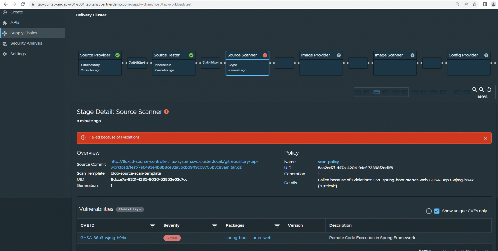
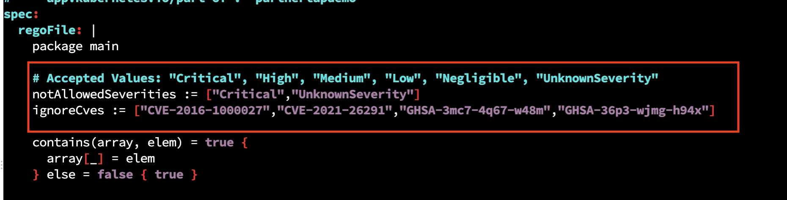
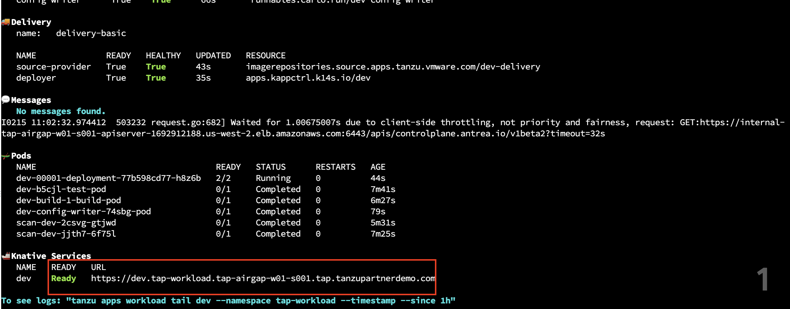
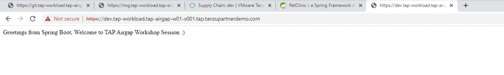

In this section, lets make some changes to the scanpolicy file and see how the application deployment goes through, how the errors can be fixed. 

```execute
tanzu apps workload list -n tap-workload
```

Edit scanpolicy and Add "Critical" to notAllowedSeverities list: 

```execute
vi $HOME/scanpolicy.yaml
```

ref Image: 

```execute
kubectl apply -f $HOME/scanpolicy.yaml -n tap-workload
```

```execute
tanzu apps workload create dev --git-repo https://gitlab.tap.tanzupartnerdemo.com/gitlab-instance-081097ef/$SESSION_NAME-repo  --git-branch main --type web -n tap-workload --label apps.tanzu.vmware.com/has-tests=true --label app.kubernetes.io/part-of={{ session_namespace }} --param-yaml buildServiceBindings='[{"name": "settings-xml", "kind": "Secret"}, {"name": "ca-certificate", "kind": "Secret"}]' --build-env "BP_MAVEN_BUILD_ARGUMENTS=-debug -Dmaven.test.skip=true --no-transfer-progress package" -y
```

```execute
tanzu apps workload apply dev --annotation autoscaling.knative.dev/minScale=1 -n tap-workload -y
```

```execute
tanzu apps workload get dev -n tap-workload
```

```execute
tanzu apps workload tail dev --namespace tap-workload --timestamp --since 5m
```

```dashboard:open-url in app stream url
url: https://tap-gui.{{ session_namespace }}.tap.tanzupartnerdemo.com/supply-chain/host/tap-workload/dev
```

After few mins, you notice the workload deployment do not progress and few errors can be under workload supply chain in TAP GUI as shown below: 

ref Image: 

```execute
ctrl+c
```

Add the CVE **GHSA-36p3-wjmg-h94x** to ignoreCves list as shown in below image: 

ref Image: 

```execute
kubectl apply -f $HOME/scanpolicy.yaml -n tap-workload
```

```execute
tanzu apps workload get dev -n tap-workload
```

```execute
tanzu apps workload tail dev --namespace tap-workload --timestamp --since 1h
```

```execute
<ctrl+c>
```

```execute
tanzu apps workload get dev -n tap-workload
```

ref Image: 

###### Verify in TAP GUI Supply chain status: 

```dashboard:open-url - App Stream
url: https://tap-gui.{{ session_namespace }}.tap.tanzupartnerdemo.com/supply-chain/host/tap-workload/dev
```

ref Image: 


```dashboard:open-url
url: https://dev.tap-workload.{{ session_namespace }}.tap.tanzupartnerdemo.com/
```

ref Image: 
